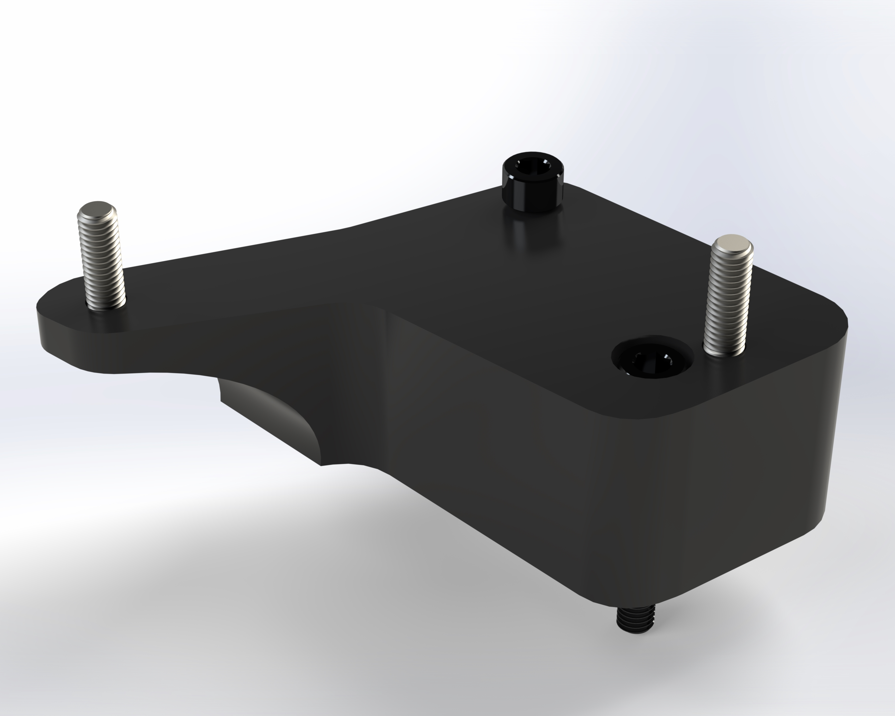
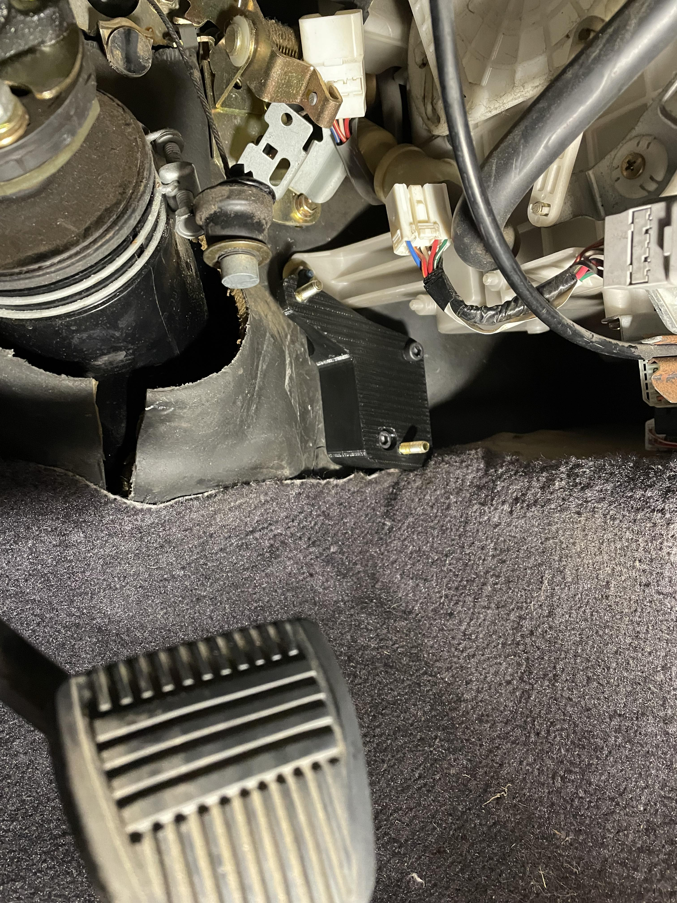
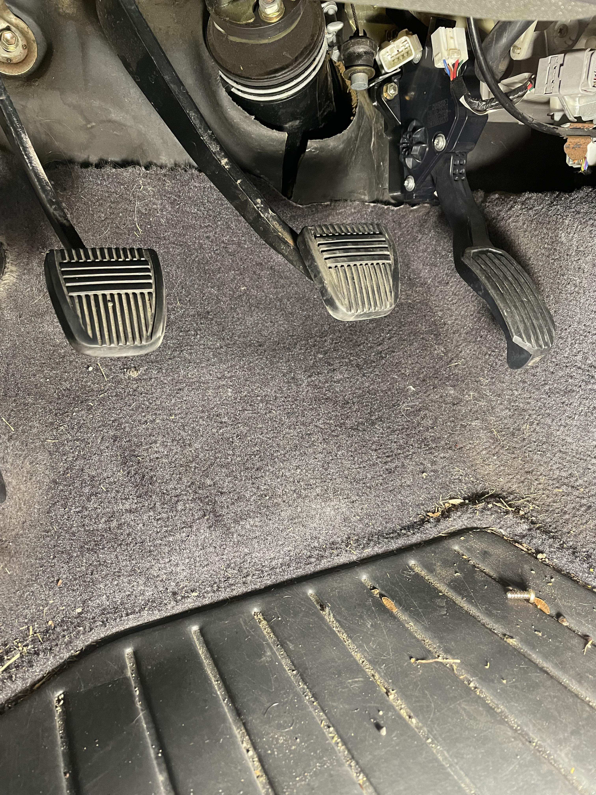

# ST185DBW
Information and 3d print files to help convert a ST185 Celica to drive by wire

# Pedal Adapter
Included in this repository is a SolidWorks 2022 assembly and .3MF file that allows you to print out the adapter itself.

Hardware required for the adapter:
- [Socket Head Cap Screw M6x1x45 (2)](https://www.mcmaster.com/91290A204)
- [Hex Head Screw M6x1x45 (1)](https://www.mcmaster.com/95327A531)
- [Hex Head Screw M6x1x20 (1)](https://www.mcmaster.com/90854A135)
- M6 Nuts (2)

I suggest buying the specific part number from McMaster as linked above as the fit of the bolt head is integral to the part. You can also just modify the part.

The part number of the pedal used is 78110-33020 from Toyota. Very common.

All of this is just me noodling around in the garage and making parts for me. I wanted to share. Any issue you have with the part is not my responsibility. Use at your own risk.

(it's been fine for me for over 2 years now)